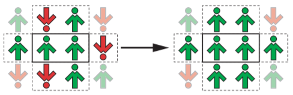

# Simulation of the Dynamics of Opinion

# Opis
Katarzyna Sznajd-Weron wraz z Józefem Sznajdem stworzyli prosty model dynamiki opinii, który okazał się ogromnym sukcesem. 
Jest badany do dziś i w dalszym ciągu dostarcza wielu ciekawych wyników. Znalazł zastosowanie w modelowaniu wyników wyborów, konkurencji produktów na rynku, 
oraz tworzeniu nowego rodzaju sieci złożonych. Koncepcja modelu model Sznajdów jest oparta na fakcie znanym w psychologii społecznej jako społeczny dowód słuszności. 
Otóż, jeśli jakaś osoba o zdaniu odmiennym od naszego próbuje nas przekonać do swoich racji, to ma przed sobą trudne zadanie. Lecz gdy jednocześnie dwie lub więcej osób, 
które zgadzają się ze sobą, ale mają inne zdanie niż my i próbują wywrzeć na nas presję, to może im się udać bez porównania łatwiej.

Ogólny schemat wygląda następująco:
* Najpierw wybieramy grupę dwóch sąsiadujących ze sobą agentów,
* Jeśli są oni ze sobą zgodni, to ich sąsiedzi przyjmują podzielaną przez nich opinię. Jeśli nie, nic się nie dzieje,
* Powtarzamy procedurę.

## Technologie:
* **C# 8.0**,
* **.NET WinForms**.
